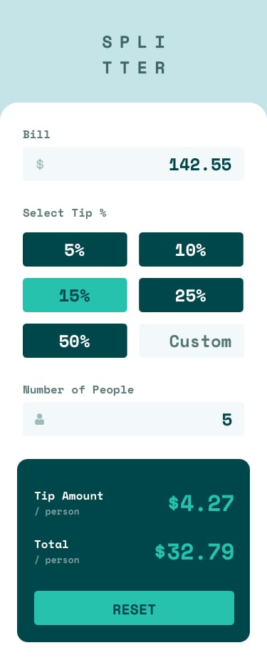

# 💰 Tip Calculator

Una calculadora de propinas moderna y elegante construida con React, diseñada para calcular propinas y dividir cuentas de manera fácil y rápida.


## ✨ Características

- 🎨 **Diseño Moderno**: Interfaz elegante con efectos glassmorphism y animaciones fluidas
- 📱 **Completamente Responsive**: Optimizado para desktop, tablet y móviles
- ⚡ **Cálculos Instantáneos**: Resultados en tiempo real mientras escribes
- 🎯 **Validación de Entrada**: Validación en tiempo real con mensajes de error claros
- 🌈 **Efectos Visuales**: Animaciones suaves, sombras dinámicas y efectos hover
- 💡 **Fácil de Usar**: Interfaz intuitiva con iconos descriptivos
- 🔄 **Botón Reset**: Limpia todos los campos con un solo clic

## 🚀 Demo en Vivo

[Ver Demo](https://nahueldefazio.github.io/Tip-Calculator)

## 📸 Capturas de Pantalla

### Desktop


### Mobile


## 🛠️ Tecnologías Utilizadas

- **React 17.0.2** - Framework principal
- **CSS3** - Estilos avanzados con gradientes y animaciones
- **JavaScript ES6+** - Lógica de la aplicación
- **HTML5** - Estructura semántica
- **GitHub Pages** - Hosting y despliegue

## 📦 Instalación

### Prerrequisitos

- Node.js (versión 14 o superior)
- npm o yarn

### Pasos de Instalación

1. **Clona el repositorio**
   ```bash
   git clone https://github.com/nahueldefazio/Tip-Calculator.git
   cd Tip-Calculator
   ```

2. **Instala las dependencias**
   ```bash
   npm install
   ```

3. **Ejecuta la aplicación**
   ```bash
   npm start
   ```

4. **Abre tu navegador**
   ```
   http://localhost:3000
   ```

## 🎮 Cómo Usar

1. **Ingresa el monto de la cuenta** en el campo "Bill"
2. **Selecciona el porcentaje de propina** (5%, 10%, 15%, 25%, 50%) o ingresa un valor personalizado
3. **Especifica el número de personas** para dividir la cuenta
4. **Ve los resultados** automáticamente calculados:
   - Propina por persona
   - Total por persona

## 🎨 Características de Diseño

### Efectos Visuales
- **Glassmorphism**: Efectos de vidrio con backdrop-filter
- **Gradientes Dinámicos**: Fondos con múltiples puntos de color
- **Animaciones CSS**: Transiciones suaves con cubic-bezier personalizado
- **Sombras Multicapa**: Efectos de profundidad y elevación
- **Micro-interacciones**: Efectos hover y focus en todos los elementos

### Paleta de Colores
- **Primario**: `hsl(183, 100%, 15%)` - Verde azulado oscuro
- **Secundario**: `hsl(172, 67%, 45%)` - Verde azulado claro
- **Acento**: `hsl(185, 41%, 84%)` - Verde azulado muy claro
- **Fondo**: `hsl(189, 41%, 97%)` - Gris muy claro
- **Error**: `#e74c3c` - Rojo para validaciones

### Tipografía
- **Fuente Principal**: Space Mono (Google Fonts)
- **Pesos**: 400 (Regular), 700 (Bold)
- **Jerarquía**: Títulos, subtítulos y texto con diferentes tamaños

## 📱 Diseño Responsive

### Breakpoints
- **Desktop**: > 1024px
- **Tablet**: 768px - 1024px
- **Mobile Large**: 480px - 768px
- **Mobile Medium**: 320px - 480px
- **Mobile Small**: < 320px

### Adaptaciones
- **Layout**: Grid de 2 columnas → 1 columna en móviles
- **Tipografía**: Tamaños escalables según dispositivo
- **Espaciado**: Padding y margin adaptativos
- **Botones**: Tamaños optimizados para touch

## 🔧 Estructura del Proyecto

```
src/
├── Components/
│   ├── Left/
│   │   ├── Left.js          # Componente principal izquierdo
│   │   ├── Left.css         # Estilos del panel izquierdo
│   │   ├── GridTip.js       # Grilla de botones de propina
│   │   └── GripTip.css      # Estilos de la grilla
│   └── Right/
│       ├── Right.js         # Componente del panel derecho
│       └── Right.css        # Estilos del panel derecho
├── design/                  # Imágenes de diseño
├── images/                  # Iconos y assets
├── App.js                   # Componente principal
├── App.css                  # Estilos globales
├── index.js                 # Punto de entrada
└── index.css                # Estilos base
```

## 🎯 Funcionalidades

### Cálculos
- **Propina por persona**: `(Monto × Porcentaje) ÷ Personas`
- **Total por persona**: `(Monto ÷ Personas) + Propina por persona`
- **Validación**: Números positivos y no nulos
- **Precisión**: Redondeo a 2 decimales

### Validaciones
- **Bill**: No puede ser negativo
- **People**: No puede ser cero o negativo
- **Custom Tip**: No puede ser negativo
- **Feedback Visual**: Bordes rojos y mensajes de error

### Estados
- **Normal**: Campos con bordes sutiles
- **Hover**: Efectos de elevación y cambio de color
- **Focus**: Bordes destacados y efectos de glow
- **Error**: Bordes rojos con sombras de error
- **Seleccionado**: Botón de propina con animación pulse

## 🚀 Despliegue

### GitHub Pages
```bash
npm run build
npm run deploy
```

### Netlify
1. Conecta tu repositorio de GitHub
2. Configura el build command: `npm run build`
3. Configura el publish directory: `build`

### Vercel
```bash
npm install -g vercel
vercel
```

## 🤝 Contribuir

1. Fork el proyecto
2. Crea una rama para tu feature (`git checkout -b feature/AmazingFeature`)
3. Commit tus cambios (`git commit -m 'Add some AmazingFeature'`)
4. Push a la rama (`git push origin feature/AmazingFeature`)
5. Abre un Pull Request

## 📝 Licencia

Este proyecto está bajo la Licencia MIT. Ver el archivo [LICENSE](LICENSE) para más detalles.

## 👨‍💻 Autor

**Nahuel De Fazio**
- GitHub: [@nahueldefazio](https://github.com/nahueldefazio)
- LinkedIn: [Nahuel De Fazio](https://linkedin.com/in/nahueldefazio)

## 🙏 Agradecimientos

- [Frontend Mentor](https://www.frontendmentor.io/) por el desafío de diseño
- [Google Fonts](https://fonts.google.com/) por la fuente Space Mono
- [React](https://reactjs.org/) por el framework increíble
- Comunidad de desarrolladores por la inspiración

## 📊 Estadísticas


---

⭐ **¡Si te gusta este proyecto, no olvides darle una estrella!** ⭐